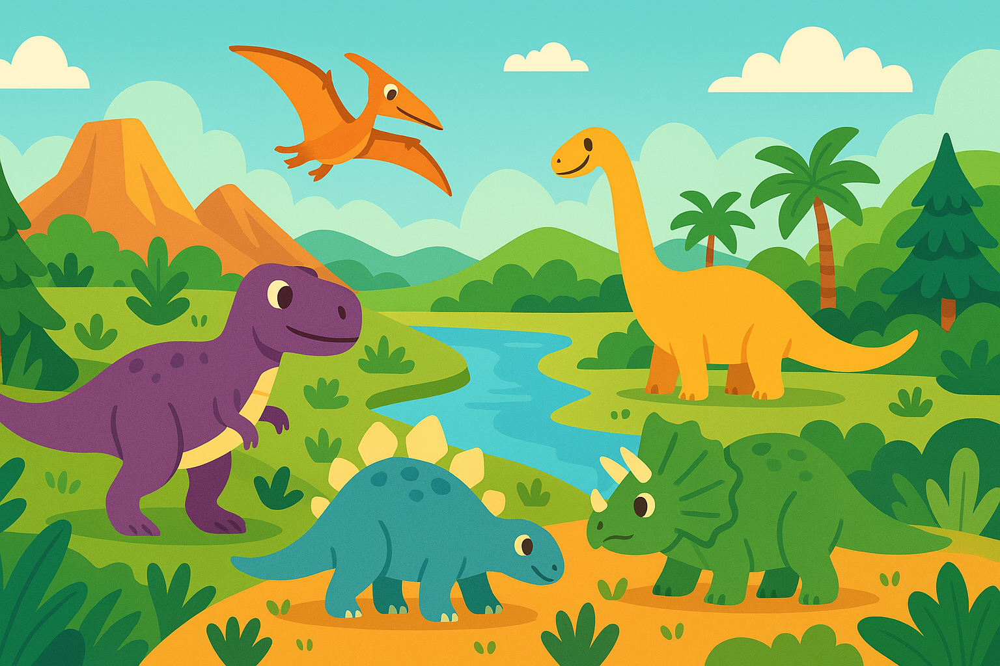

# Dino Digger: Bone Battle

A prehistoric twist on the classic Battleship game where you hunt for dinosaur bones instead of ships! Place your dinosaur fossils on your excavation grid and try to find the computer's hidden bones before it finds yours.



## 🦖 Features

- **Dinosaur-themed Battleship**: Play a classic game with a prehistoric twist
- **Multiple Dinosaur Bones**: Place T-Rex, Stegosaurus, Triceratops, Velociraptor, and Compsognathus bones
- **Random Placement**: Auto-place your bones with one click if you're feeling lucky
- **Responsive Design**: Play on desktop or mobile devices
- **Customizable**: Rotate bones horizontally or vertically before placement
- **Victory Celebration**: Enjoy confetti animation when you win

## 🚀 Live Demo

Check out the live demo: [https://battleship-for-dinos.vercel.app/](https://battleship-for-dinos.vercel.app/)

## 🛠️ Installation

Follow these steps to get the game running on your local machine:

1. **Clone the repository**
   ```bash
   git clone https://github.com/devbyray/battleship-for-dinos.git
   cd battleship-for-dinos
   ```

2. **Install dependencies**
   ```bash
   npm install
   ```

3. **Run the development server**
   ```bash
   npm run dev
   ```

4. **Open your browser**
   The game will be available at http://localhost:3000

## 📦 Building for Production

To create a production build:

```bash
npm run build
```

To preview the production build:

```bash
npm run preview
```

## 🎮 How to Play

1. **Setup Phase**:
   - Place your dinosaur bones on your excavation grid
   - You can rotate bones using the "Rotate" button
   - For quick setup, use the "Random" button to auto-place your bones
   - Click "Start Digging" when all bones are placed

2. **Gameplay**:
   - Take turns with the computer digging for bones
   - Click on the computer's grid to dig for bones
   - A hit will be marked red, a miss will be marked with an X
   - The game shows which dinosaur bone was hit

3. **Winning**:
   - The first player to discover all of the opponent's bones wins
   - When all segments of a bone are discovered, it will be highlighted

## 🦕 Dinosaurs and Bone Sizes

- **T-Rex**: 5 segments
- **Stegosaurus**: 4 segments
- **Triceratops**: 3 segments
- **Velociraptor**: 3 segments
- **Compsognathus**: 2 segments

## 💻 Technologies Used

- HTML5
- CSS3 (with CSS Modules)
- JavaScript (ES6+)
- Vite (for building and development)
- Canvas Confetti (for victory animation)

## 🌐 Browser Support

- Chrome
- Firefox
- Safari
- Edge

## 📝 License

This project is licensed under the ISC License - see the LICENSE file for details.

## 👨‍💻 Author

Created by [Your Name]

## 🙏 Acknowledgements

- Dinosaur SVG icons from [SVG Repo](https://www.svgrepo.com/)
- Font Awesome for UI icons
- Inspiration from the classic Battleship game

---

Enjoy digging for bones and have a roaring good time! 🦖